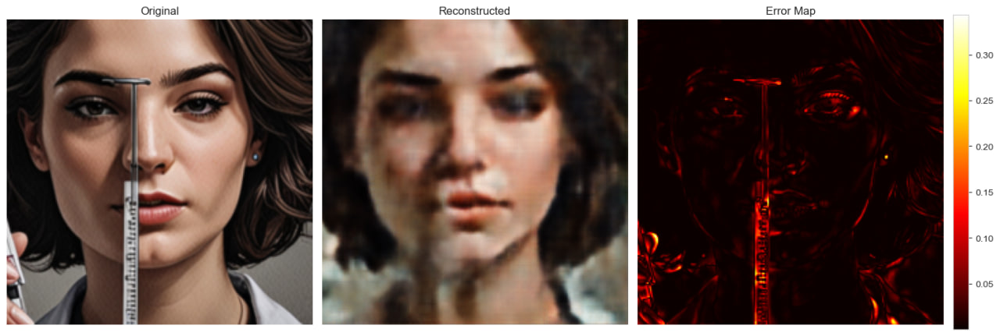
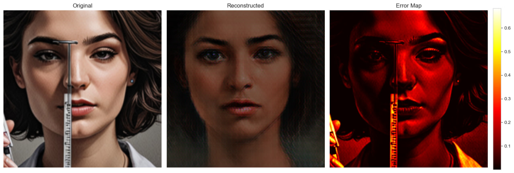
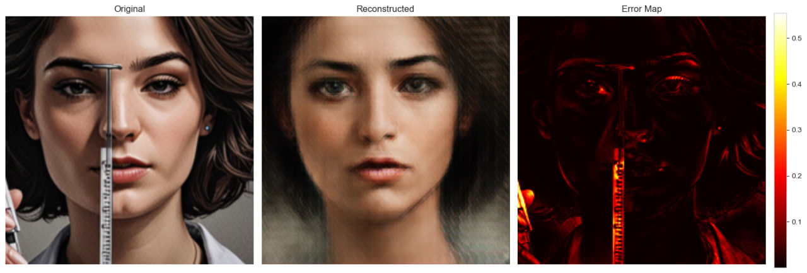
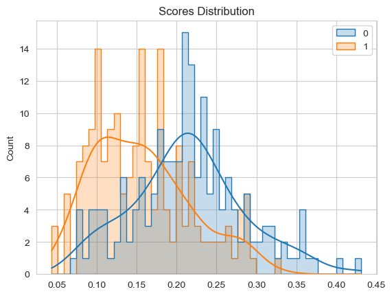
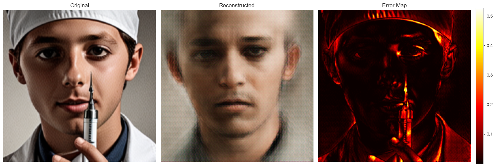
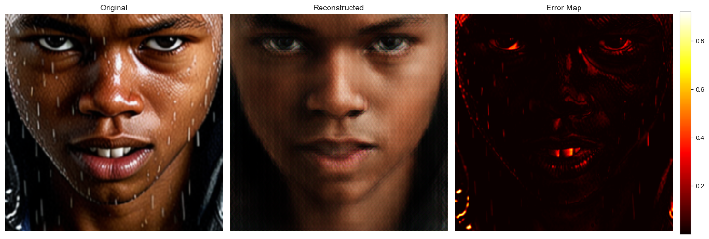
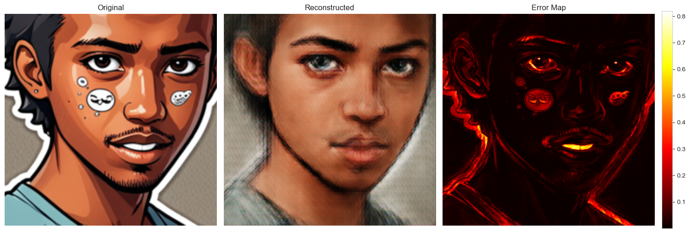
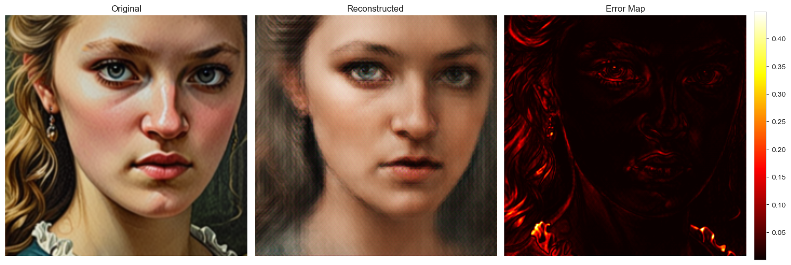
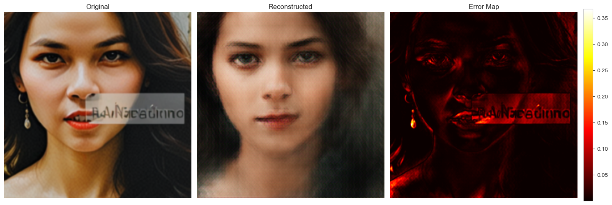

# Anomaly Detection and Elimination in Generated Portraits

This project was developed as an assigment for the **GenAI Course** hosted by **IT-Jim**. The objective is to detect and eliminate generative anomalies in AI-generated images of people using **Autoencoder-based** model.

## 🏗️ Model Architecture & Optimization

The system utilizes a Convolutional Autoencoder designed to learn a compressed representation of "normal" faces. The goal is to create a bottleneck that reconstructs clean faces accurately but fails to reproduce anomalous patterns.

### 1. Hybrid Loss Function Strategy
I experimented with three loss configurations to find the optimal balance between sharpness and color accuracy:
* **MSE:** Produced blurry reconstructions and struggled with high-frequency textures.
* **VGG (Perceptual):** Captured structural integrity effectively but caused color shifts and darkened the output.
* **Hybrid Approach:** The final model uses a combination of VGG and MSE:
  $$L_{total} = \alpha \cdot L_{VGG} + \beta \cdot L_{MSE}$$
  This configuration leverages VGG for anatomical structure and MSE to anchor the color gamut and brightness.

### 2. Latent Space Bottleneck Selection
The size of the latent dimension was critical. I compared sizes of **128, 256, and 512**:
* **Finding:** Larger dimensions (512) provided too much capacity, allowing the model to "memorize" and reconstruct the artifacts.
* **Decision:** A **128-dimensional bottleneck** was selected as it forces the model to learn a generalized face manifold, effectively "filtering out" anomalies.

<figure>
    <figcaption align="left"><i>MSE Loss, Latent size 512</i></figcaption>
    
</figure>

<figure>
    <figcaption align="left"><i>VGG Loss, Latent size 128</i></figcaption>
    
</figure>

<figure>
    <figcaption align="left"><i>Hybrid Loss, Latent size 128</i></figcaption>
    
</figure>

---

## 🔍 Threshold Selection

Instead of calculating the mean error across the entire image, I implemented a **Top-k Pixel Mean** strategy.

### Top-k Pixel Logic
Since artifacts are often localized, a global average error often "washes out" the signal. By focusing on the top-k percent of pixels with the highest reconstruction error, the model becomes significantly more sensitive to small, localized defects.

### Validation Performance
The threshold was selected to maximize the Macro F1-score on the validation set.

| Configuration | Top-k % | Best Threshold | Best F1 |
| :--- | :--- | :--- | :--- |
| **Hybrid 128** | **0.07** | **0.1838** | **0.7054** |

#### Validation Confusion Matrix:
| Actual \ Predicted | Anomaly (0) | Clean (1) |
| :--- | :---: | :---: |
| **Anomaly (0)** | **123** | 57 |
| **Clean (1)** | 49 | **131** |

---

## 📊 Performance Results

The final evaluation was performed on a held-out test set using the **Hybrid 128** configuration.

### Quantitative Metrics
| Metric | Value |
| :--- | :--- |
| **Test Micro F1-score** | **0.6850** |
| **Test Macro F1-score** | **0.5651** |
| **Test Weighted F1-score** | **0.7478** |

### Confusion Matrix (Test Set)
| Actual \ Predicted | Anomaly (0) | Clean (1) |
| :--- | :---: | :---: |
| **Anomaly (0)** | 16 | 4 |
| **Clean (1)** | 59 | 121 |

---

## 🖼️ Qualitative Analysis: Artifact Cleanup

The trained Autoencoder acts as a "generative filter." Because the model has never seen artifacts during training, it attempts to replace them with "normal" textures during reconstruction.

**Visual Pipeline:**
1. **Original:** The input image with a generative defect.
2. **Reconstructed:** The "cleaned" version where the artifact is suppressed.
3. **Error Map:** A heatmap highlighting the top-k pixels where the model struggled, pinpointing the anomaly location.

---

### Conclusion
Among all tested configurations, the **Hybrid 128** model emerged as the clear winner. Despite its **straightforward and relatively simple architecture**, it demonstrated remarkable effectiveness in capturing diverse generative failures. 

By strategically combining perceptual-focused training with a constrained latent space and localized (Top-k) error analysis, the system achieves a high level of detection accuracy. These results prove that a well-tuned, lightweight Autoencoder can serve as a robust, unsupervised "safety net" for generative pipelines without the need for complex labeled datasets.